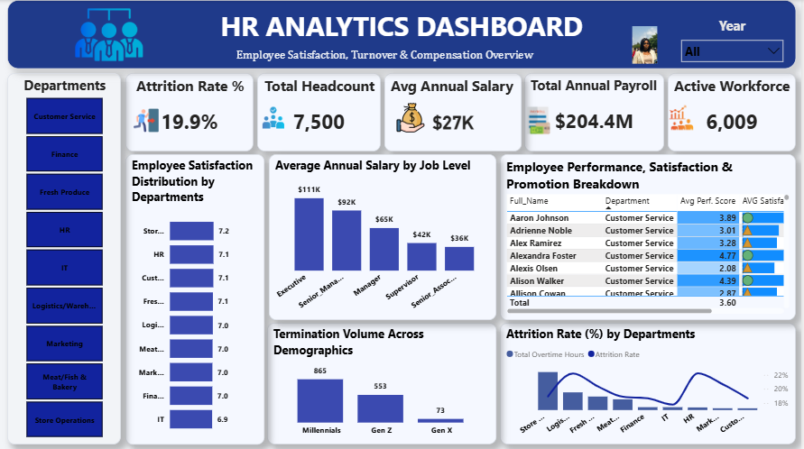
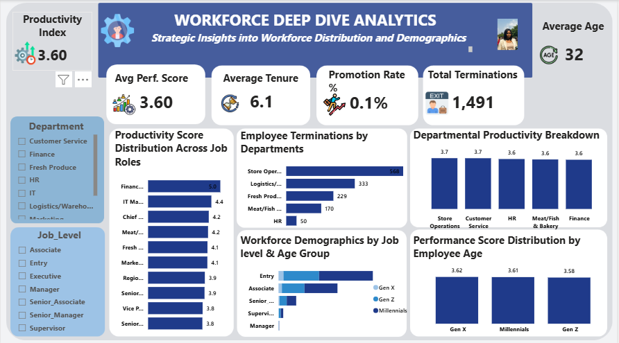

# HR Analytics Dashboard (Power BI)

A two-page Power BI report analysing employee turnover, pay, satisfaction and productivity across a workforce of 7,500 employees.

*Author:* Felix Ukamaka Peace
[LinkedIn](https://www.linkedin.com/in/ukamaka-felix-4160993ab) | [Portfolio](https://felix-ukamaka-peace.lovable.app) | [Read the article on Medium](https://medium.com/@beautyfelix6/my-data-analytics-portfolio-3-dashboards-3-business-stories-6b60c470a729)

## Business Questions
1. Why are employees leaving, and who is most likely to go?
2. How do pay, satisfaction and performance compare across departments and job levels?
3. How productive is the workforce, and does age or role make a difference?

## Dashboard Pages
*Page 1: HR Analytics Dashboard*
- KPI cards: Attrition Rate, Total Headcount, Average Annual Salary, Total Annual Payroll, Active Workforce
- Employee satisfaction by department
- Average annual salary by job level
- Employee performance, satisfaction and promotion table
- Termination volume across demographics
- Attrition rate by department, compared with overtime hours
- Department slicer

*Page 2: Workforce Deep Dive Analytics*
- KPI cards: Productivity Index, Average Age, Average Performance Score, Average Tenure, Promotion Rate, Total Terminations
- Productivity score by job role
- Employee terminations by department
- Departmental productivity breakdown
- Workforce demographics by job level and age group
- Performance score by employee age
- Department and Job Role slicers

## Key Insights
- Out of *7,500* employees, *1,491* have left. That is an attrition rate of *19.9%, leaving **6,009* active employees.
- *Millennials* account for about 58% of terminations (865), followed by Gen Z (553) and Gen X (73).
- *Store Operations* has the most terminations (568), followed by Logistics (333) and Fresh Produce (229).
- Pay goes up a lot with seniority, from about *$36K* for Senior Associates to *$111K* for Executives. The average salary is *$27K, and the annual payroll is *$204.4M**.
- The *promotion rate is only 0.1%*, which may help explain the turnover.
- Satisfaction scores are close across departments (6.9 to 7.2), and performance scores are almost identical across age groups (3.58 to 3.62).

## Recommendations
- Focus retention efforts on Store Operations and on younger employees.
- Review how promotions are decided, since almost nobody is being promoted.
- Look at the link between overtime hours and attrition in the departments with the highest turnover.

## Tools Used
- Power BI
- DAX (formulas for the measures and calculations)

## Contact
Felix Ukamaka Peace | beautyfelix6@gmail.com
